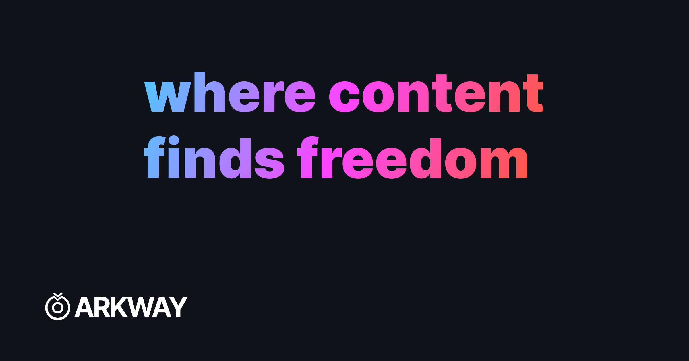

# 📁 Arkway

Arkway is a decentralized and distributed file storage solution designed to keep your files secure and encrypted. With Arkway, you can store your valuable data with peace of mind, knowing that it is protected from unauthorized access.



---

## Features ✨

1. Arkway is its use of the **Lit protocol** for encryption. This protocol combines the power of Multi-Party Computation (`MPC`) and Threshold Secret Sharing (`TSS`) encryption methods.
2. MPC ensures that the encryption process is distributed among multiple nodes, preventing any single party from having complete control over the encryption key.
3. TSS further enhances security by dividing the key into shares, which are held by different nodes. This means that even if some nodes are offline or have malicious intent, the network can still function and your data remains safe.
4. Arkway employs Polybase, a decentralized database that leverages zero knowledge proofs. This unique combination of blockchain attributes and the speed and privacy of a database allows for efficient and secure storage of your files.
5. It's not just about security and encryption; it also offers a user-friendly experience. The platform is designed to be easy to use, allowing you to seamlessly upload, access, and manage your files.

---

## How it works?

Arkway operates by using access control conditions to decrypt data securely. For example, Arkway utilizes a simple authentication signature, known as an authSig, which confirms that the user possesses a specific wallet address.

When a file is uploaded to Arkway, its metadata is encrypted using the authSig. This encryption process generates a symmetrical key and an encrypted string. The encrypted symmetrical key is then stored on Polybase, our decentralized database.

When it comes time to decrypt the file, we use the encrypted symmetrical key to obtain symmetrical key using authentication signature and then decrypt the encrypted string and provide access to the file's contents.

---

## Video Demo 🎥

You can find the video demo [here](https://youtu.be/IWUhJVC9kvg):

https://youtu.be/IWUhJVC9kvg

---

## Tech Stack 💻

- [Next.js](https://nextjs.org/)
- [TypeScript](https://www.typescriptlang.org/)
- [thirdweb](https://thirdweb.com/)
- [NextUI](https://nextui.org/)
- [Lit Protocol](https://litprotocol.com/)
- [Polybase](https://polybase.xyz/)

---

## Getting Started 🚀

To get started with Arkway, the first step is to clone the GitHub repository. You can do this by running the following command in your terminal:

```bash
git clone https://github.com/Envoy-VC/arkway.git

```

Next, you'll need to install the project's dependencies. You can do this by running the following command in your terminal:

```bash
npm install
```

Now, let's set up the database schema. The schema defines the structure and organization of the database. To do this, follow these steps:

1. Navigate to the schema folder within the project.
2. Open the `index.ts` file. This file contains the schema for the database.
3. To deploy the schema, you can refer to the documentation at https://polybase.xyz/docs/collections. It will guide you on how to create and deploy a schema.
4. After creating the schema, you will receive a collection namespace. This is a unique identifier for your schema. Store this namespace in a file named `.env.local`.

```bash
NEXT_PUBLIC_POLYBASE_NAMESPACE='your-namespace'
```

Great! You're almost ready to start using Arkway. The last step is to start the development server.

```bash
npm run dev
```

---
